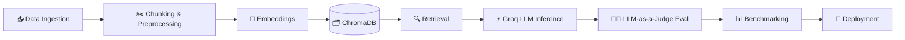

<div align="center">


[](https://abhay-iitr.netlify.app/)
[](https://www.linkedin.com/in/abhay-kumar-968155218/)
[](https://leetcode.com/u/abhayaditya327/)
[](mailto:abhay_k@ee.iitr.ac.in)


</div>

---

## 👨‍💻 About Me

I'm an Electrical Engineering undergrad at **IIT Roorkee**, building at the intersection of **GenAI, MLOps, and applied Data Science**. At **PwC India** I shipped a production-style **RAG pipeline** with sub-second retrieval and an **LLM-as-a-Judge** evaluation layer — since then I've kept building: agent evaluation frameworks, sentiment-driven trading systems, and real-time full-stack platforms.

**I'm not just looking for a role — I ship, evaluate, and ship again.** Currently open to full-time **Data Science / ML Engineering / GenAI** positions, and available to start immediately.

```python
abhay = {
    "education":   "B.Tech EE · IIT Roorkee (2022 - 2026)",
    "focus":       ["LLMs", "RAG Systems", "Agentic AI", "MLOps", "NLP"],
    "experience":  "PwC India — GenAI/AI Technology Consultant Intern",
    "shipped":     "RAG pipelines · Agent eval frameworks · LLM-as-a-Judge",
    "status":      "🟢 Open to full-time offers — available immediately"
}
```

---

## ⚙️ MLOps Pipeline — How I Ship AI Systems

<div align="center">

</div>



---

## 🛠️ Tech Stack

**Languages**


**AI / ML & GenAI**


**Backend, Web & Infra**


**Databases & Tools**


---

## 🚀 Featured Projects

| Project | Impact | Stack |
|---|---|---|
| 🤖 **[Agent Testing Framework](https://github.com/abhay1201)** <!-- add exact repo link --> | Agent-agnostic AI eval framework — 20+ structured test cases covering reasoning, safety, prompt injection & jailbreak attacks with LLM-as-a-Judge scoring | `Python` `LangChain` `Groq LLM` `FastAPI` |
| 🧠 **[RAG Chatbot](https://github.com/abhay1201/RAG_CHATBOT)** | Retrieval-augmented QA system with low-latency LLM inference and contextual grounding | `LangChain` `ChromaDB` `HuggingFace` |
| 📈 **[Stock Sentiment Trading Bot](https://github.com/abhay1201/Stock-sentiment-analysis-using-Machine-Learning)** | VADER-NLP sentiment trading bot on TSLA/META headlines — **66.67% win ratio**, evaluated via Sharpe ratio & drawdown | `PyTorch` `Scikit-learn` `NLTK` |
| ⚡ **[EV Charging Management System](https://github.com/abhay1201)** <!-- add exact repo link --> | Real-time WebSocket backend + React dashboard for live EV charging telemetry and optimization | `Node.js` `React` `PostgreSQL` `WebSockets` |
| 📄 **[pdf-QnA-AI](https://github.com/abhay1201/pdf-QnA-AI)** | Document Q&A system over PDFs using transformer-based retrieval | `Transformers` `NLTK` `Flask` |

> 📌 *Pin these on your profile — recruiters check pinned repos first.*

---

## 📊 GitHub Stats

<div align="center">


</div>

---

## 🏆 Highlights & Achievements

- 🎓 **B.Tech, Electrical Engineering** — IIT Roorkee (2022–2026)
- 💼 **Technology Consultant Intern (GenAI/AI) @ PwC India** — shipped a low-latency RAG QA system + LLM-as-a-Judge eval framework
- 🥇 **NTSE Stage 1** — Rank 9
- 💻 **Codeforces Specialist** (Max 1458) · **500+ DSA problems** solved across LeetCode & other platforms
- 🌍 Global ranks: **#1113** Codeforces Edu Round 168 (Div. 2) · **#1884** Codeforces Round 953 (Div. 2)
- 🏅 **NSS Best Member Award** — top performer among 30 members, IIT Roorkee NSS chapter
- 🧑‍💼 **Senior Manager, E-Summit IIT Roorkee** — organized North India's largest entrepreneurship fest, 1000+ participants, 200+ delegates coordinated

---

## 🟢 Currently

🔭 Building agent evaluation & guardrail systems for LLM-based agents
🌱 Deepening MLOps practices — CI/CD for ML, observability, evaluation pipelines
💬 Ask me about RAG architecture, LLM evaluation, or agentic AI systems
⚡ **Open to full-time Data Science / ML Engineering / GenAI roles — available immediately**

---

<div align="center">

*"Data is not information. Information is not knowledge. Knowledge is not wisdom."*

**Let's connect and build something meaningful.**

[](https://abhay-iitr.netlify.app/)


</div>
